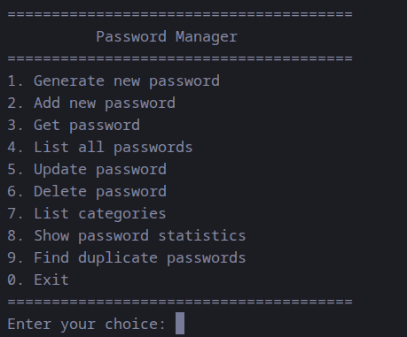

# Password Manager

 [](https://opensource.org/licenses/MIT)

Утилита для локального безопасного хранения паролей. Все данные шифруются алгоритмом **AES-256-GCM** и сохраняются в файл `passwords.dat`.



---

## Функциональность

- **Генерация паролей** — создание криптостойких паролей заданной длины (от 8 символов) с использованием `crypto/rand`
- **Добавление пароля** — сохранение пары «сервис → пароль» с указанием категории
- **Просмотр пароля** — поиск по имени сервиса и отображение всех деталей
- **Список всех паролей** — таблица с именем, категорией, датами создания и изменения
- **Обновление пароля** — замена существующего пароля с проверкой сложности
- **Удаление пароля** — удаление записи по имени сервиса
- **Категории** — просмотр всех используемых категорий
- **Статистика** — общее количество паролей, распределение по категориям, самая старая и новая запись
- **Поиск дубликатов** — обнаружение одинаковых паролей, используемых в разных сервисах
- **Шифрование** — весь vault шифруется AES-256-GCM, данные хранятся в файле `passwords.dat`

---

## Требования к системе

- **Go** версии 1.26 или выше
- **ОС** — Linux, macOS, Windows (поддерживается `golang.org/x/term`)

---

## Установка

```bash
# Клонирование репозитория
git clone https://github.com/ivanboriev/password-manager.git
cd password-manager

# Сборка
go build -o ./build/pm ./cmd/pm

# Запуск
./build/pm
```

Или через Make:

```bash
make build   # сборка
make run     # сборка + запуск
```

---

## Примеры использования

### Как CLI-утилита

При запуске утилита запрашивает мастер-пароль (минимум 8 символов) и показывает интерактивное меню:

```
=======================================
          Password Manager
=======================================
1. Generate new password
2. Add new password
3. Get password
4. List all passwords
5. Update password
6. Delete password
7. List categories
8. Show password statistics
9. Find duplicate passwords
0. Exit
=======================================
Enter your choice:
```

### Как Go-библиотека

```go
package main

import (
	"fmt"
	"log"

	"github.com/ivanboriev/password-manager/passwordmanager"
	"github.com/ivanboriev/password-manager/vault"
)

func main() {
	// Генерация криптостойкого пароля
	pwd, err := passwordmanager.GeneratePassword(16)
	if err != nil {
		log.Fatal(err)
	}
	fmt.Println("Generated:", pwd)

	// Проверка сложности пароля
	if err := passwordmanager.CheckPasswordStrength(pwd); err != nil {
		log.Fatal(err)
	}

	// Создание и инициализация хранилища
	v := vault.New("passwords.dat")
	if err := v.SetMasterKey("my-secure-master-key"); err != nil {
		log.Fatal(err)
	}

	// Сохранение пароля
	if err := v.Save("github", pwd, "dev"); err != nil {
		log.Fatal(err)
	}

	// Загрузка существующего vault из файла
	if err := v.LoadFromFile(); err != nil {
		log.Printf("No existing vault, starting fresh: %v", err)
	}

	// Получение пароля
	entry, err := v.Get("github")
	if err != nil {
		log.Fatal(err)
	}
	fmt.Printf("Service: %s, Password: %s\n", entry.Name, entry.Value)

	// Список всех паролей
	for _, p := range v.List() {
		fmt.Println(p.Name, p.Category)
	}

	// Сохранение в зашифрованный файл (AES-256-GCM)
	if err := v.SaveToFile(); err != nil {
		log.Fatal(err)
	}
}
```

---

## Структура проекта

```
password-manager/
├── art/                      # Скриншот интерфейса
│   └── pm.png
├── cmd/
│   └── pm/
│       └── main.go           # Точка входа CLI
├── passwordmanager/          # Публичный библиотечный пакет
│   ├── password.go           #   Password, NewPassword
│   ├── generate.go           #   GeneratePassword
│   └── validate.go           #   CheckPasswordStrength
├── vault/                    # Пакет шифрованного хранилища
│   └── vault.go              #   Vault (CRUD, AES-256-GCM, save/load)
├── cli/                      # Пакет терминального интерфейса
│   └── cli.go                #   Меню, хендлеры, главный цикл
├── .gitignore
├── go.mod / go.sum
├── Makefile
└── README.md
```

---

## Планы по развитию

- [ ] Key Derivation Function (Argon2/PBKDF2) для мастер-пароля
- [ ] Поддержка TOTP (одноразовые коды)
- [ ] Импорт/экспорт паролей (CSV, JSON)
- [ ] Графический интерфейс (TUI или веб-версия)
- [ ] Двухфакторная аутентификация для доступа к vault
- [x] Модульная архитектура (разделение на пакеты)
- [ ] Юнит-тесты
- [ ] CI/CD (GitHub Actions)

---

## Лицензия

Проект распространяется под лицензией MIT. Подробнее — в файле [LICENSE](LICENSE).
